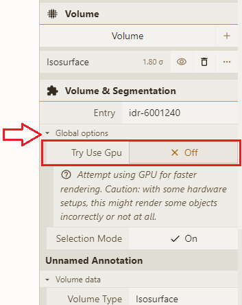

# Known issues and limitations

## General
The limitations of Mol\*VS are related primarily to the scarcity of segmentation data and insufficient unification of volumetric and segmentation data formats. As of December 2022, EMDB and EMPIAR together contain less than 20 [entries with segmentation data](https://www.ebi.ac.uk/empiar/volume-browser/), and even these few data sets are not fully consistent in terms of data hierarchy. This is expected to change in the future, as substantial effort is being expended to unify cell imaging data under [EMDB-SFF](http://europepmc.org/article/MED/28682240) (electron microscopy) and [OME-NGFF](https://www.nature.com/articles/s41592-021-01326-w) (light microscopy). We are actively cooperating with teams from EMDB, EMPIAR, and BioImageArchive to ensure that Mol\*VS always contains the latest segmentation data available in these primary sources. Meanwhile, we have included several examples to indicate that Mol\*VS is prepared to handle data sets delivered in EMDB-SFF, other formats that can be converted to EMDB-SFF via the [sfftk Python package](https://sfftk.readthedocs.io/en/latest/) integrated in Mol\*VS (.am, .mod, .seg, .stl), and OME-NGFF.

One important limitation is related to the data structures currently used by Mol\*VS. Specifically, it is currently not possible to store and display multiple segmentations for the same volumetric map within the same entry. These will show as separate entries of the internal Mol\*VS database (e.g., emd-90940001 and emd-90940002 were obtained from the same source data emd-9094 using different segmentation tools). However, such entries can be displayed concomitantly and thus easily compared.

Finally, some limitations are related to the current state of Mol\* Viewer. Because the source data vary substantially, it has so far not been possible to establish default settings that work equally well for all data sets and all machines. We describe these below in the hope that you will be able to overcome whatever trouble you encounter while using Mol\*VS.

## GPU support
Some graphics cards may fail to render certain data, or may render them wrong. If the **Mol\* Viewer Log Panel** (bottom) does not report any error but you cannot see anything in the **3D Canvas** (center), go to the **Control Panel** (left), open the **Global options** and try turning **GPU support** off. Alternatively, you may try to [run Mol* Viewer with WebGL 1](https://molstar.org/viewer/?prefer-webgl1=1).

## Isosurface
Some data sets may fail to render or may render wrong or with too much noise when using the default isosurface settings. If the **Mol\* Viewer Log Panel** (bottom) does not report any error but you cannot see anything or what you see seems wrong or noisy in the **3D Canvas** (center), go to the **Control Panel** (left), open the **Detailed Volume Params**, click the three dots to open the **Isosurface** options, and try tuning the **Iso Value**.

## Direct volume
Some data sets may fail to render or may render wrong or with too much noise when using isosurface render. If the **Mol\* Viewer Log Panel (bottom)** does not report any error but you are not satisfied with the representation in the **3D Canvas** (center), go to the **Control Panel** (left) and change the **Volume Type** from **Isosurface** to **Direct volume**. You may also need to open the **Detailed Volume Params**, click the three dots to open the **Direct Volume** options, then click the value of the  **Control Points** and try tuning the points until you are satisfied with the result.

